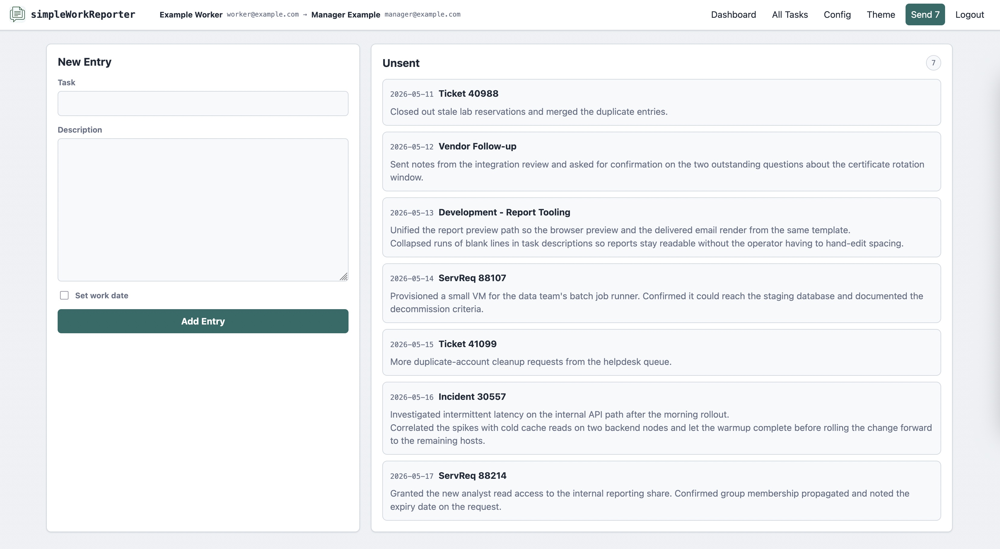

# simpleWorkReporter

simpleWorkReporter is a simple web-app designed to streamline the regular _work summary_ email your manager asks you to send.  Yes, you're already tracking your work in the ticket system, your code check-ins are easily auditable, and they could just duck into your team stand-ups every now and again, but here we are.

Add short work entries during the day, review the pending list, and send it off as a formatted SMTP report.  Sent entries stay in history.  It is a single-user, self-hosted tool -- not a team tracker.

## Quick Start

Clone the repo, set up a virtualenv, run the setup wizard, and start the server.

```bash
git clone https://github.com/na-parse/simpleWorkReporter.git
cd ./simpleWorkReporter

python3 -m venv .venv
. .venv/bin/activate
python -m pip install -r requirements.txt

./swr setup
./swr start
```

The setup wizard walks through worker/manager identity, SMTP settings, service port, an optional access passphrase, and HTTP vs HTTPS mode.  Once running, point a browser at the configured port and start adding tasks.



> [!NOTE]
> Detailed deployment notes -- system dependencies, running behind a reverse proxy, systemd, multi-instance layouts -- live in [`./deploy/DEPLOYING.md`](./deploy/DEPLOYING.md).

## Command Reference

All functionality is exposed through a single dispatcher script, `./swr`:

```text
./swr <verb> [args...]

  start            Start the web service
  setup            Run the interactive setup / reconfigure wizard
  config           Alias for setup
  db               Database maintenance (init, demo, convert-swr1-db)
  cert             Self-signed HTTPS certificate maintenance
  send             Send the pending report (cron-friendly)
```

Run `./swr <verb> -h` for verb-specific help.

## Sending the Report

Reports can be sent two ways:

- **From the web app** -- the _Send Report_ button in the header opens a preview of the pending entries and current SMTP settings.  Confirming on that page sends the mail; visiting the URL alone does not.  On success, the included entries are marked sent and the dashboard returns to an empty pending list.  On failure, entries stay pending and the SMTP error is shown.
- **From the CLI** -- `./swr send` sends the current pending report headlessly, with no confirmation prompt.  This is intended for cron or another scheduler.  Normal status output is written to stdout; errors are written to stderr.  Schedulers can redirect stdout to `/dev/null` and still receive error mail.

```bash
SWR_HOME=/path/to/data /path/to/checkout/swr send >/dev/null
```

Pass `-f` / `--force` to bypass the send lock when a previous send is stuck.

## HTTP vs HTTPS

The service binds to `0.0.0.0` on the configured port by default, so it is reachable from the LAN.  Pass `--bind 127.0.0.1` (or `-b 127.0.0.1`) to `./swr start` to restrict it to loopback -- useful when fronting the app with a reverse proxy on the same host.

It runs in one of two modes:

- **Self-signed HTTPS** for stand-alone operation.  Setup can generate `cert.pem` and `key.pem` in the data directory.  When both exist, `./swr start` runs HTTPS only.
- **Plain HTTP** for local-only use or when nginx, Apache, Caddy, or another reverse proxy terminates HTTPS in front of the app.  Startup prints a warning in this mode.

Re-running `./swr setup` (or `./swr config`) shows the current certificate state and offers a menu to add, replace, or remove the cert files.

## SMTP

Reports are sent from the worker address to the manager address (worker is copied).  Three SMTP modes are supported:

- **STARTTLS** with authentication -- normally port `587`.
- **Implicit TLS / SMTPS** with authentication -- normally port `465`.
- **Plain SMTP** without authentication -- normally port `25`.

Authenticated plain SMTP and unauthenticated TLS SMTP are intentionally not supported.  The stored SMTP password is never shown in the UI; leave the replacement field blank on the config page to keep the existing value.

## Tools

All of the maintenance verbs live behind `./swr`.  These are for developers, operators, and one-off maintenance -- they aren't part of normal day-to-day use.

| Command | Purpose |
| --- | --- |
| `./swr setup` (or `./swr config`) | Interactive setup / reconfigure wizard. |
| `./swr start` | Start the local web service. |
| `./swr send` | Send the pending report headlessly (for cron). |
| `./swr cert` | Manage the self-signed HTTPS certificate. |
| `./swr db` | Initialize, seed, or migrate the SQLite database. |

`./swr db demo` will load varied fixture entries for visual testing.  Add `--clear` to wipe existing tasks first, and `-y` for non-interactive use.  Don't point it at a real working database.

`./swr db convert-swr1-db <path>` imports a legacy simpleWorkReporter v1 `tasks.db` into the v2 database layout.  This is a one-shot migration utility; it refuses to write if the destination already contains tasks unless `--force` is given.
